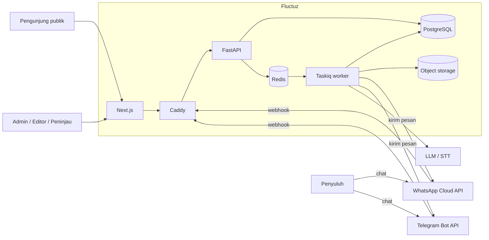
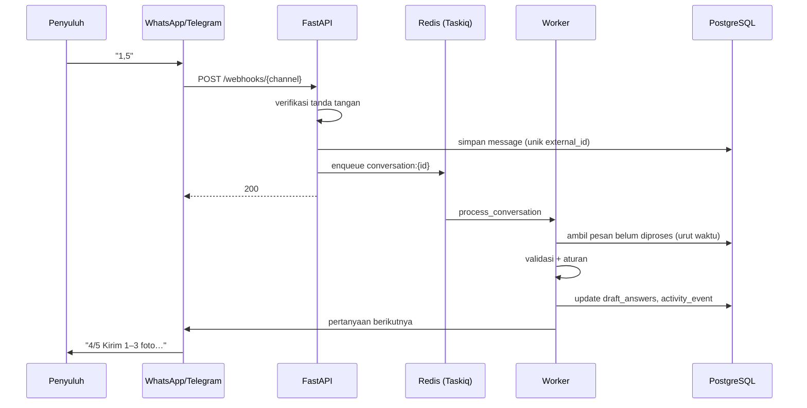
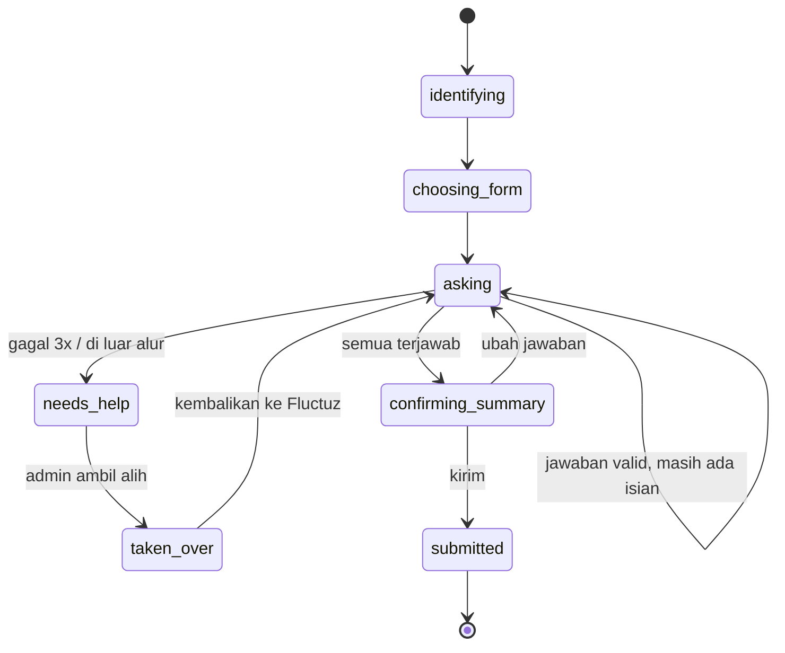

# System Diagrams

## Konteks sistem

```mermaid
flowchart LR
  visitor[Pengunjung publik] --> web
  admin[Admin / Editor / Peninjau] --> web
  worker_person[Penyuluh] -->|chat| wa[WhatsApp Cloud API]
  worker_person -->|chat| tg[Telegram Bot API]

  subgraph fluctuz[Fluctuz]
    caddy[Caddy]
    web[Next.js]
    api[FastAPI]
    queue[(Redis)]
    jobs[Taskiq worker]
    db[(PostgreSQL)]
    files[(Object storage)]
  end

  web --> caddy
  caddy --> api
  wa -->|webhook| caddy
  tg -->|webhook| caddy
  api --> db
  api --> queue
  queue --> jobs
  jobs --> db
  jobs --> files
  jobs -->|kirim pesan| wa
  jobs -->|kirim pesan| tg
  jobs --> llm[LLM / STT]
```

## Pesan masuk sampai laporan

```mermaid
sequenceDiagram
  participant P as Penyuluh
  participant K as WhatsApp/Telegram
  participant A as FastAPI
  participant Q as Redis (Taskiq)
  participant W as Worker
  participant D as PostgreSQL

  P->>K: "1,5"
  K->>A: POST /webhooks/{channel}
  A->>A: verifikasi tanda tangan
  A->>D: simpan message (unik external_id)
  A->>Q: enqueue conversation:{id}
  A-->>K: 200
  Q->>W: process_conversation
  W->>D: ambil pesan belum diproses (urut waktu)
  W->>W: validasi + aturan
  W->>D: update draft_answers, activity_event
  W->>K: pertanyaan berikutnya
  K->>P: "4/5 Kirim 1–3 foto…"
```

## Status percakapan

```mermaid
stateDiagram-v2
  [*] --> identifying
  identifying --> choosing_form
  choosing_form --> asking
  asking --> asking: jawaban valid, masih ada isian
  asking --> needs_help: gagal 3x / di luar alur
  asking --> confirming_summary: semua terjawab
  needs_help --> taken_over: admin ambil alih
  taken_over --> asking: kembalikan ke Fluctuz
  confirming_summary --> asking: ubah jawaban
  confirming_summary --> submitted: kirim
  submitted --> [*]
```
